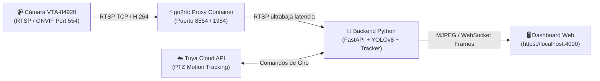

# 📹 Guía Rápida de Configuración de Cámara — VTA-84920 (Tuya Smart Life)

Esta guía detalla los **pasos exactos, rápidos y claros** para que cualquier colaborador despliegue y use la **misma configuración de cámara** en el menor tiempo posible y sin fricciones.

---

## 🧭 Diagrama de Flujo de Video y Visión



---

## ⚡ Inicio Rápido (En 3 Pasos)

Si la cámara ya está conectada al router en la IP predeterminada (`192.168.1.76`):

1. **Abre PowerShell en la raíz del proyecto:**
   ```powershell
   cd C:\Users\ayola\OneDrive\Desktop\Proyectos\Proyectoxspoiler\proyecto-seguridad-vial
   ```
2. **Inicia los servicios con el script automatizado:**
   ```powershell
   .\start-run.ps1
   ```
   *(Esto iniciará automáticamente Docker Compose con `go2rtc`, `backend` y `mosquitto`, regenerará certificados SSL según tu IP LAN y abrirá los puertos).*
3. **Abre el Dashboard en tu navegador:**
   - Navega a: **`https://localhost:4000`** (o a la IP LAN que te indique la consola).
   - ¡Listo! En la sección superior derecha verás la insignia verde **`🟢 Conectado`** y la transmisión en vivo con detección de personas y vehículos.

---

## 📋 Configuración Detallada Paso a Paso

### Paso 1: Conectar la Cámara a la Red Wi-Fi
1. Asegúrate de que la cámara **VTA-84920** esté encendida y vinculada a la red Wi-Fi de 2.4 GHz mediante la aplicación móvil **VTA Smart** o **Tuya Smart**.
2. **Obtén la IP local de la cámara:**
   - En la app móvil: Entra a los ajustes de la cámara > *Información del dispositivo* > *Dirección IP*.
   - O en la tabla de clientes DHCP de tu router Wi-Fi (busca dispositivo con nombre similar a `VTA`, `Tuya` o fabricante de la cámara).
3. *(Opcional pero muy recomendado)*: En el router, asigna una **IP fija/estática** a la dirección MAC de la cámara para que nunca cambie.

---

### Paso 2: Si tu IP es Diferente a `192.168.1.76`

Si tu cámara tiene otra IP (por ejemplo `192.168.1.50`):

#### Opción A: Desde la Interfaz Web (Sin reiniciar nada ⚡)
1. Abre el Dashboard en `https://localhost:4000`.
2. En la barra superior, en el campo **`📹 VTA RTSP:`**, escribe la nueva IP.
3. Haz clic en el botón azul **`Conectar Cámara VTA`**.
4. El backend cambiará la conexión en caliente inmediatamente.

#### Opción B: En los Archivos de Configuración (Para que quede guardado permanentemente)
1. **Edita `docker-compose.yml`**:
   Busca la línea:
   ```yaml
   - RTSP_CAMERA_IP=192.168.1.76  # Cambia por tu IP
   ```
2. **Edita `go2rtc.yaml`**:
   Actualiza la IP en los streams de ffmpeg:
   ```yaml
   streams:
     vta_camera:
       - exec:ffmpeg -rtsp_transport tcp -i "rtsp://admin:12345@TU_NUEVA_IP:554/live/ch0" -c copy -f rtsp {output}
       - exec:ffmpeg -rtsp_transport tcp -i "rtsp://admin:12345@TU_NUEVA_IP:554/stream1" -c copy -f rtsp {output}
   ```
3. Reinicia los contenedores:
   ```powershell
   docker compose down ; docker compose up -d
   ```

---

### Paso 3: Credenciales y Parámetros Preconfigurados

Los siguientes parámetros ya están listos en el proyecto para esta cámara:

| Parámetro | Valor por Defecto | Descripción |
|---|---|---|
| **Usuario RTSP** | `admin` (o `BmU0FIYfd`) | Usuario local ONVIF/RTSP |
| **Contraseña RTSP** | `12345` (o `Ayolaisaac444`) | Contraseña del stream local |
| **Puerto RTSP** | `554` | Puerto estándar RTSP |
| **Ruta del Stream** | `/live/ch0` | Canal principal H.264 |
| **Proxy go2rtc RTSP** | `rtsp://go2rtc:8554/vta_camera` | Stream procesado sin sobrecarga |
| **Tuya Client ID** | `3a8cs4wmgppk54p9pkvv` | API Cloud para comandos PTZ |
| **Tuya Secret** | `8c7656d031a544a19461ec6eb9dc764b` | Llave secreta Tuya Cloud |
| **Tuya Device ID** | `eb66bb9aa668e53f31gxsh` | ID del dispositivo en Tuya Cloud |
| **YOLO Confianza** | `0.35` | Umbral de detección IA |
| **Modo Cartelera** | `true` | Calibración visual automática de zona |

---

## 🧪 Pruebas y Diagnóstico

### 1. Probar el Stream de la Cámara desde Python CLI
Para verificar que tu PC alcanza a la cámara y que las credenciales son correctas antes de abrir Docker:
```powershell
python scripts/test_vta_rtsp.py --ip 192.168.1.76 --user admin --pass 12345
```
Se abrirá una ventana de OpenCV mostrando el video en vivo con las cajas delimitadoras de YOLOv8.

### 2. Verificar el Proxy go2rtc
Abre en tu navegador:
```
http://localhost:1984
```
Este es el panel web administrativo de **go2rtc**. En la sección `streams`, haz clic en `links` > `webrtc` o `stream.mjpeg` junto a `vta_camera` para previsualizar el video directo.

### 3. Verificar el Estado del Backend
Consulta el endpoint de salud de la cámara:
```powershell
curl -k https://localhost:4000/api/camera/rtsp/status
```
Respuesta esperada:
```json
{
  "enabled": true,
  "status": "CONNECTED",
  "ip": "192.168.1.76",
  "fps": 30.0,
  "processedFrames": 1240,
  "lastError": null
}
```

---

## 🎯 Funcionalidades Especiales Activas

### 1. Seguimiento Motorizado de Peatones (Motion Tracking)
- En el panel web, encontrarás el botón **`🎯 Activar Seguimiento`**.
- Al activarlo, el backend envía la instrucción mediante la API de Tuya Cloud para que el motor físico de la cámara gire automáticamente siguiendo a personas o vehículos detectados.

### 2. Detección Inteligente de Cartelera / Cebra (`BILLBOARD_MODE`)
- El algoritmo detecta automáticamente un área rectangular dentro del cuadro (por ejemplo, una cartelera o maqueta de paso de cebra) y recalcula la zona de riesgo sin necesidad de definir coordenadas manuales.

---

## ❓ Preguntas Frecuentes y Solución de Problemas

### ❌ El estado muestra "🔴 Sin señal IP" o pantalla negra
1. **Verifica conectividad IP:** Ejecuta `ping 192.168.1.76` en PowerShell. Si no responde, la cámara cambió de IP o está apagada.
2. **Revisa la red Wi-Fi:** Tu computadora debe estar en la **misma red Wi-Fi** o conectada al mismo router que la cámara. Si estás en una red de "Invitados" (Guest Network), el aislamiento de clientes bloqueará el puerto 554.
3. **Cierra la app móvil:** Si la aplicación Tuya Smart está abierta viendo el video en vivo en tu teléfono, puede agotar el límite de streams simultáneos de la cámara. Ciérrala en el celular para liberar la sesión.

### ❌ Error de certificado al entrar a `https://localhost:4000`
- Al ser un certificado autofirmado local para desarrollo, el navegador mostrará una advertencia de seguridad.
- Haz clic en **"Configuración avanzada"** y luego en **"Continuar a localhost (no seguro)"**.

### ❌ ¿Cómo apago todo el sistema?
Simplemente ejecuta:
```powershell
.\off-server.ps1
```
O directamente con Docker:
```powershell
docker compose down
```
